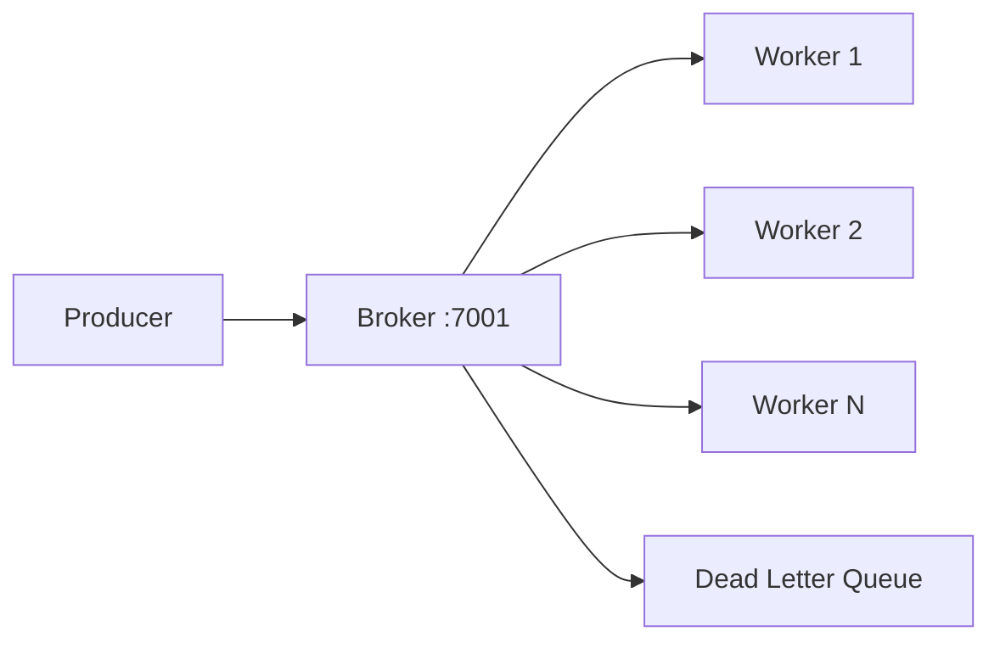

# Distributed Work Queue

[](https://go.dev/)
[](LICENSE)

Distributed task queue with a broker/worker architecture, retry logic, dead-letter handling, and concurrent worker pools. Inspired by Celery and Sidekiq, built to demonstrate reliable background job processing.

## Architecture



## Quick start

```bash
make demo
```

Or manually:

```bash
# Terminal 1 — broker
go run ./cmd/broker

# Terminal 2 — workers
go run ./cmd/worker --concurrency 4

# Terminal 3 — enqueue a task
curl -X POST http://localhost:7001/enqueue \
  -H 'Content-Type: application/json' \
  -d '{"type":"email.send","payload":{"to":"user@example.com"}}'
```

## Features

- HTTP broker with enqueue/dequeue endpoints
- Configurable worker concurrency
- Automatic retry with max-attempt limits
- Dead-letter queue for permanently failed tasks
- JSON-serialized task payloads

## API

| Method | Path | Description |
|--------|------|-------------|
| `POST` | `/enqueue` | Submit a new task |
| `GET` | `/dequeue` | Pull next task (workers) |

## Project layout

```
cmd/broker/           Task broker HTTP server
cmd/worker/           Concurrent worker pool
internal/queue/       Task model, memory broker, retry logic
```

## Development

```bash
make build    # compile binaries
make demo       # broker + worker + sample task
make test       # run unit tests
```

## Roadmap

- [ ] Redis-backed broker for multi-process deployment
- [ ] Delayed and periodic task scheduling
- [ ] Task priority queues

## License

MIT — see [LICENSE](LICENSE).
